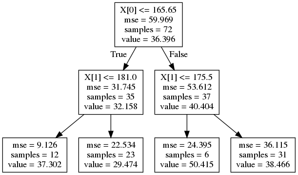

 <h1>Analysis of a concrete-slump-measurements dataset</h1> 

**Author:** Leonardo Espin.

Date: 7/03/2019

Concrete slump measurements are used to [determine concrete properties](https://en.wikipedia.org/wiki/Concrete_slump_test) before it sets. In this analysis, I use measurements of properties of a concrete mixture, such as water and cement content,  to predict the concrete compressive strength. [I test two types of models for making predictions](https://leoespin.github.io/concrete_slump/), a decision-tree regression model and a random-forest model. 

